Hi Am ADEREMI ADESANMI
======================================================================================================================================

Software Engineer
======================================================================================================================================

Amenable Software Engineer gifted at translating basic client requirements into technical development plans. Communicates productively with both technical and non-technical personnel and clients. Friendly provider of deep programming knowledge and invaluable final products, also a Network Support Engineer with up to 2years of comprehensive experience designing, implementing and maintaining the growing network infrastructure. An analytical and logical professional quickly learns new concepts paired to complement understanding of networking protocols and OSI or TCP models. Commended for providing top-notch, hands-on technical support.

* 🌍  I'm based in Nigeria
* ✉️  You can contact me at [adesanmiaderemi@hotmail.com](mailto:adesanmiaderemi@hotmail.com)
* 🚀  I'm currently working on [About me website](https://remtechportfolio.com/)
* 🤝  I'm open to collaborating on Interesting projects
* ⚡  I'm a lover of good knowledge, Making new friends and Praying.

  <h2> Hello World! </h2>
   <h3> I'm Adesanmi Aderemi <a href="https://remtechportfolio.com" target="_blank">Remtech </a> </h3>
   
 <b>  Software Craftsperson 💼 | Learner 📚 | Maker 👨🏻‍💻 | Explorer 🔎 </b> 

   <a href="mailto:adesanmiaderemi@gmail.com" target="_blank">Mail </a> | <a href="https://remtechportfolio.com" target="_blank">Portfolio </a> | <a href="https://www.linkedin.com/in/aderemi-adesanmi-63aa7a12a/" target="_blank">LinkedIn </a> 
   
 I code to make lives easier, to learn and for fun! 

     

  
 If you like my work, hit <b>✨ Follow ✨</b> for updates 

  
 <b> 🔥 Keep making noises with your keyboard! 🔥 </b>

  
  

    
<i> 🪄 Click here for a Magic trick! 🪄 </i>

     
      Aha! I tricked you into clicking 😋
      
      Now can you hit the <b>✨ Follow ✨</b> button too please 🫣
  

